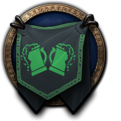

# Project Title

Little Discord Bot developed with [Node.js](https://nodejs.org/en/) and [Discord.io API](https://github.com/izy521/discord.io) for Way to Wype guild.

[](https://img.shields.io/npm/v/gh-badges.svg)

## About Way to Wype



[Way to Wype](http://eu.battle.net/wow/fr/guild/elune/Way_to_Wype/) is a French guild on Elune-EU Server.

You can send a private message to Arctarus#2334 to get more informations and an invite to our Discord server.

## Built With

* [Node.js](https://nodejs.org/en/)
* [Discord.io](https://github.com/izy521/discord.io)
* [Blizzard API](https://dev.battle.net)

## Requirments

If you want to use functionnaly of this bot, you need to add an **auth.json** config file in the root folder and add your API Key for Discord and Blizzard API.

```json
{
  "token": "YOUR-DISCORD-API-TOKEN",
  "wowApiKey": "YOUR-BLIZZARD-API-TOKEN"
}
```
_Note : Don't add the auth.json in your repository, it's your private data !_

## Contributing

You can contact me to contribute to this bot and if you want more command.

## Authors

* **Arctarus** - *Initial work* - [Arct4](https://github.com/Arct4)

See also the list of [contributors](https://github.com/Arct4/way-to-wype-bot/contributors) who participated in this project.

## License

This project is licensed under the MIT License - see the [LICENSE](LICENSE) file for details.

## TODO List

- [x] Welcome message send in DM with custom message
- [ ] Calendar : See, Add, Update, Remove events from a list
- [x] Calendar : Send automatic message when an event occur in a day (_set a default channel to send message needed_)
- [ ] Member : Add roster's members with a specific rank (like Guild Master or Roster)
- [ ] Member : Add data about gems and enchants for roster's members
- [ ] Member : Get items, gems and enchants for a specific player
- [ ] Member : Update Class and Role from Armory (no more need of commands like _raid-member-set-role_)
- [ ] Guide : Found on Wowhead, Icy Veins or other site a guide for class or profession
- [ ] Improvement : Send bot's answer with multipart messages to avoid Discord limit (2000 characters)
- [ ] Improvement : Let user set a custom prefix for command
- [ ] Improvement : Add translation management
